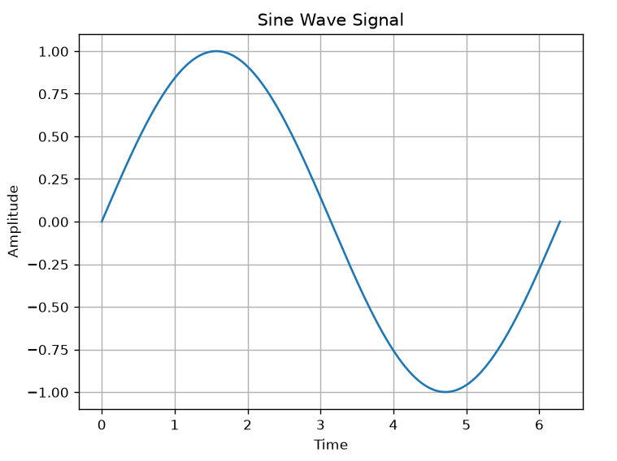

An engineering-focused Python project that visualizes sine wave signals using NumPy and Matplotlib, helping users understand signal behavior, amplitude, and time-domain representation.

# 📈 Signal Visualizer

A Python-based signal visualization project that generates and plots a sine wave using NumPy and Matplotlib.

This project helps students understand fundamental signal processing concepts such as waveform generation, amplitude, and time-domain representation.

---

## 🚀 Features

- Generate a sine wave signal
- Visualize the signal using Matplotlib
- Learn basic signal processing concepts
- Beginner-friendly Python project
- Useful for ECE and EE students

---

## 🛠️ Technologies Used

- Python 🐍
- NumPy
- Matplotlib

---

## 📷 Output Screenshot



---

## 📂 Project Structure

```text
signal-visualizer/
│
├── signal_visualizer.py
├── screenshot.png
└── README.md
